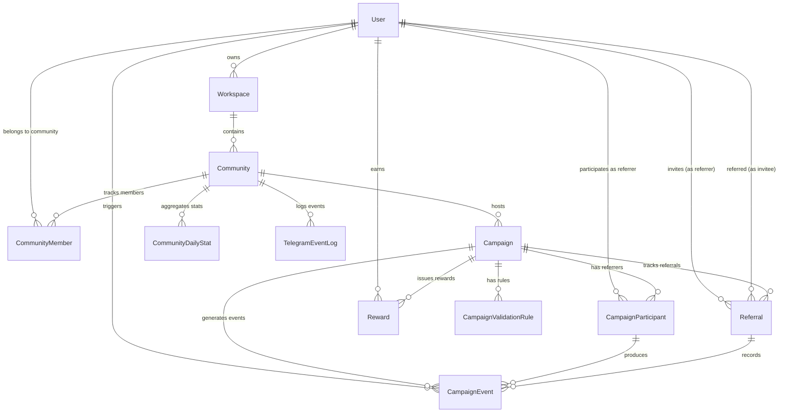

# GrowBot - Database Design & Schema Specification (Phase 1)

This document specifies the database architecture, entity relationships, indexes, caching strategies, and Prisma ORM schema for **GrowBot** based on the Phase 1 MVP Scope (`assets/phase-1.md`) and updated product requirements.

---

## 1. Overview & Architectural Goals

The GrowBot database is built on **PostgreSQL** and managed via **Prisma ORM**. It handles multi-tenant workspace management, Telegram bot webhooks, Mini App referral attribution, campaign lifecycle management, reward tracking, anti-cheat revocation, and community analytics.

### Key Architecture Refinements
1. **Event-Driven Audit & Projection Architecture (`CampaignEvent`)**:
   - Instead of mutating state directly on webhook events, every action produces an immutable `CampaignEvent` (e.g. `INTENT_CREATED`, `MEMBER_JOINED`, `REFERRAL_VALIDATED`, `REFERRAL_REVOKED`, `REWARD_EARNED`).
   - Ensures an immutable audit log, simplified asynchronous analytics processing, and reliable event-sourcing.
2. **Dedicated Validation Rules (`CampaignValidationRule`)**:
   - Validation criteria are normalized into a dedicated `CampaignValidationRule` table linked to a `Campaign`.
   - Allows multiple active validation rules per campaign (e.g. must stay in group for 24h AND send at least 1 message).
3. **Advanced Anti-Cheat & Rejoin Metrics on `CommunityMember`**:
   - Tracks `first_joined_at` and `rejoined_count` alongside `joined_at` and `left_at` to prevent leave-and-rejoin referral exploitation.
4. **Telegram User Representation**: Unified `User` model for both Web Dashboard administrators and Telegram community members/referrers.
5. **Workspace & Subscription Limits**: Multi-community administration with configurable workspace limits (`max_communities`, `max_campaigns`) supporting `FREE`, `PRO`, and `ENTERPRISE` plans.
6. **5-Step Attribution & Anti-Cheat Flow**:
   - **Step 1 (Link Generation)**: Participant generates unique Mini App referral link (`t.me/GrowBotApp/app?startapp=ref_CODE`).
   - **Step 2 (Seamless Auth)**: Invitee opens Mini App; backend verifies `initDataRaw` HMAC-SHA256 signature.
   - **Step 3 (Intent Registration)**: Backend logs pending intent in Redis with 24h TTL (`pending_ref:{inviteeId}:{communityChatId}`).
   - **Step 4 (Direct Join)**: Invitee joins group/channel; Telegram dispatches `chat_member` webhook update to NestJS.
   - **Step 5 (Verification & Credit / Anti-Cheat)**: Webhook verifies join against Redis, writes `Referral` and `CampaignEvent` to PostgreSQL, increments count. If invitee leaves later (`status: left`), webhook marks referral as `REVOKED`, decrements credit, and logs a `REFERRAL_REVOKED` event.

---

## 2. Entity Relationship Diagram (ERD)



---

## 3. Data Entities & Schema Breakdown

### 3.1 `User` (`users`)
Stores all Telegram users interacting with GrowBot.

| Column | Type | Constraints | Description |
| :--- | :--- | :--- | :--- |
| `id` | UUID | PK, default: `uuid()` | Primary identifier |
| `telegram_id` | BigInt | Unique, Not Null | Telegram User ID (64-bit int) |
| `username` | VarChar(255) | Nullable | Telegram handle without `@` |
| `first_name` | VarChar(255) | Not Null | Telegram first name |
| `last_name` | VarChar(255) | Nullable | Telegram last name |
| `photo_url` | Text | Nullable | Telegram avatar URL |
| `is_admin` | Boolean | Not Null, default: `false` | System admin flag |
| `created_at` | TimestampTZ | Not Null, default: `now()` | Registration timestamp |
| `updated_at` | TimestampTZ | Not Null, updated: `now()` | Last modification timestamp |

---

### 3.2 `Workspace` (`workspaces`)
Containers created by administrators to manage one or more Telegram communities.

| Column | Type | Constraints | Description |
| :--- | :--- | :--- | :--- |
| `id` | UUID | PK, default: `uuid()` | Primary identifier |
| `owner_id` | UUID | FK -> `users.id`, Not Null | Workspace owner user |
| `name` | VarChar(255) | Not Null | Workspace name |
| `slug` | VarChar(255) | Unique, Not Null | URL slug for workspace |
| `plan` | Enum | Not Null, default: `FREE` | `FREE`, `PRO`, `ENTERPRISE` |
| `max_communities` | Int | Not Null, default: `3` | Allowed communities limit |
| `max_campaigns` | Int | Not Null, default: `5` | Allowed active campaigns limit |
| `created_at` | TimestampTZ | Not Null, default: `now()` | Creation timestamp |
| `updated_at` | TimestampTZ | Not Null, updated: `now()` | Last modification timestamp |

---

### 3.3 `Community` (`communities`)
Telegram Groups, Supergroups, or Channels connected to GrowBot.

| Column | Type | Constraints | Description |
| :--- | :--- | :--- | :--- |
| `id` | UUID | PK, default: `uuid()` | Primary identifier |
| `workspace_id` | UUID | FK -> `workspaces.id`, Not Null | Parent workspace |
| `telegram_chat_id` | BigInt | Unique, Not Null | Telegram Chat ID (e.g. -100123456789) |
| `title` | VarChar(255) | Not Null | Community title |
| `username` | VarChar(255) | Nullable | Public Telegram channel/group handle |
| `type` | Enum | Not Null | `GROUP`, `SUPERGROUP`, `CHANNEL` |
| `bot_status` | Enum | Not Null, default: `ACTIVE` | `ACTIVE`, `INACTIVE`, `KICKED`, `NO_ADMIN_RIGHTS` |
| `member_count` | Int | Not Null, default: `0` | Cached total member count |
| `invite_link` | Text | Nullable | Direct join link generated by bot |
| `settings` | JSONB | Not Null, default: `{}` | Custom bot/community configurations |
| `created_at` | TimestampTZ | Not Null, default: `now()` | Connected timestamp |
| `updated_at` | TimestampTZ | Not Null, updated: `now()` | Last sync timestamp |

---

### 3.4 `Campaign` (`campaigns`)
Referral campaigns configured by administrators for a community.

| Column | Type | Constraints | Description |
| :--- | :--- | :--- | :--- |
| `id` | UUID | PK, default: `uuid()` | Primary identifier |
| `community_id` | UUID | FK -> `communities.id`, Not Null | Target community |
| `created_by_id` | UUID | FK -> `users.id`, Not Null | Admin who created campaign |
| `title` | VarChar(255) | Not Null | Campaign display title |
| `description` | Text | Nullable | Detailed description / instructions |
| `type` | Enum | Not Null, default: `MILESTONE` | `MILESTONE` (Invite X friends), `LEADERBOARD` (Top inviter competition) |
| `referral_target` | Int | Nullable | Target number of invites (for `MILESTONE` campaigns) |
| `reward_description` | Text | Not Null | Description of reward promised |
| `start_date` | TimestampTZ | Not Null | Campaign start time |
| `end_date` | TimestampTZ | Nullable | Optional campaign end time |
| `status` | Enum | Not Null, default: `DRAFT` | `DRAFT`, `ACTIVE`, `PAUSED`, `COMPLETED`, `CANCELLED` |
| `created_at` | TimestampTZ | Not Null, default: `now()` | Creation timestamp |
| `updated_at` | TimestampTZ | Not Null, updated: `now()` | Last update timestamp |

---

### 3.5 `CampaignValidationRule` (`campaign_validation_rules`)
Dedicated normalized table defining validation requirements for a referral.

| Column | Type | Constraints | Description |
| :--- | :--- | :--- | :--- |
| `id` | UUID | PK, default: `uuid()` | Primary identifier |
| `campaign_id` | UUID | FK -> `campaigns.id`, Not Null | Associated campaign |
| `rule_type` | Enum | Not Null | `IMMEDIATE`, `TIME_BOUND`, `MESSAGE_COUNT` |
| `config` | JSONB | Not Null, default: `{}` | E.g. `{"min_hours": 24}` or `{"min_messages": 1}` |
| `is_active` | Boolean | Not Null, default: `true` | Rule toggle |
| `created_at` | TimestampTZ | Not Null, default: `now()` | Creation timestamp |
| `updated_at` | TimestampTZ | Not Null, updated: `now()` | Last modification timestamp |

---

### 3.6 `CommunityMember` (`community_members`)
Membership state and activity metrics for Telegram users inside communities.

| Column | Type | Constraints | Description |
| :--- | :--- | :--- | :--- |
| `id` | UUID | PK, default: `uuid()` | Primary identifier |
| `community_id` | UUID | FK -> `communities.id`, Not Null | Target community |
| `user_id` | UUID | FK -> `users.id`, Not Null | Telegram user |
| `role` | Enum | Not Null, default: `MEMBER` | `MEMBER`, `ADMINISTRATOR`, `CREATOR` |
| `status` | Enum | Not Null, default: `ACTIVE` | `ACTIVE`, `LEFT`, `KICKED`, `BANNED` |
| `message_count` | Int | Not Null, default: `0` | Message count in group (for validation) |
| `first_joined_at` | TimestampTZ | Not Null, default: `now()` | First time user ever joined |
| `joined_at` | TimestampTZ | Not Null, default: `now()` | Most recent join timestamp |
| `left_at` | TimestampTZ | Nullable | Departure timestamp |
| `rejoined_count` | Int | Not Null, default: `0` | Number of times user left & rejoined |
| `last_active_at` | TimestampTZ | Nullable | Last message / activity timestamp |

*Unique Index*: `(community_id, user_id)`

---

### 3.7 `CampaignParticipant` (`campaign_participants`)
Tracks members participating as referrers in a specific campaign.

| Column | Type | Constraints | Description |
| :--- | :--- | :--- | :--- |
| `id` | UUID | PK, default: `uuid()` | Primary identifier |
| `campaign_id` | UUID | FK -> `campaigns.id`, Not Null | Target campaign |
| `user_id` | UUID | FK -> `users.id`, Not Null | Referrer user |
| `referral_code` | VarChar(64) | Unique, Not Null | Mini App referral code/link token |
| `total_referrals` | Int | Not Null, default: `0` | Total invitees initiated |
| `validated_referrals` | Int | Not Null, default: `0` | Total verified referrals |
| `created_at` | TimestampTZ | Not Null, default: `now()` | Opt-in / link generation time |

*Unique Index*: `(campaign_id, user_id)`

---

### 3.8 `Referral` (`referrals`)
Individual referral records linking a referrer to an invitee.

| Column | Type | Constraints | Description |
| :--- | :--- | :--- | :--- |
| `id` | UUID | PK, default: `uuid()` | Primary identifier |
| `campaign_id` | UUID | FK -> `campaigns.id`, Not Null | Associated campaign |
| `referrer_id` | UUID | FK -> `users.id`, Not Null | User who shared the link |
| `invitee_id` | UUID | FK -> `users.id`, Not Null | User who clicked & joined |
| `status` | Enum | Not Null, default: `PENDING_JOIN` | `PENDING_JOIN`, `PENDING_VALIDATION`, `VALIDATED`, `INVALIDATED`, `REVOKED`, `EXPIRED` |
| `invalidated_reason` | VarChar(255) | Nullable | Reason for disqualification (e.g. `LEFT_EARLY`, `FAKE_ACCOUNT`) |
| `intent_at` | TimestampTZ | Not Null, default: `now()` | Mini App link click time |
| `joined_at` | TimestampTZ | Nullable | Bot webhook member join time |
| `validated_at` | TimestampTZ | Nullable | Successful validation time |
| `revoked_at` | TimestampTZ | Nullable | Timestamp when member left and referral credit was revoked |

*Unique Index*: `(campaign_id, invitee_id)` (An invitee can only be attributed once per campaign)

---

### 3.9 `CampaignEvent` (`campaign_events`)
Immutable event stream recording all campaign activities (clicks, intents, joins, validations, revocations, rewards).

| Column | Type | Constraints | Description |
| :--- | :--- | :--- | :--- |
| `id` | UUID | PK, default: `uuid()` | Primary identifier |
| `campaign_id` | UUID | FK -> `campaigns.id`, Not Null | Associated campaign |
| `participant_id` | UUID | FK -> `campaign_participants.id`, Nullable | Associated participant |
| `user_id` | UUID | FK -> `users.id`, Nullable | User triggering or affected by event |
| `referral_id` | UUID | FK -> `referrals.id`, Nullable | Associated referral record |
| `event_type` | VarChar(64) | Not Null | E.g., `INTENT_CREATED`, `MEMBER_JOINED`, `REFERRAL_VALIDATED`, `REFERRAL_REVOKED`, `REWARD_EARNED` |
| `metadata` | JSONB | Not Null, default: `{}` | Additional event payload details |
| `created_at` | TimestampTZ | Not Null, default: `now()` | Event generation timestamp |

---

### 3.10 `Reward` (`rewards`)
Records reward entitlements for referrers who achieve campaign targets or leaderboard rankings.

| Column | Type | Constraints | Description |
| :--- | :--- | :--- | :--- |
| `id` | UUID | PK, default: `uuid()` | Primary identifier |
| `campaign_id` | UUID | FK -> `campaigns.id`, Not Null | Associated campaign |
| `user_id` | UUID | FK -> `users.id`, Not Null | Referrer who earned reward |
| `reward_title` | VarChar(255) | Not Null | Copy of campaign reward description |
| `status` | Enum | Not Null, default: `PENDING` | `PENDING`, `APPROVED`, `DELIVERED`, `REJECTED` |
| `notes` | Text | Nullable | Admin fulfillment notes / tracking info |
| `earned_at` | TimestampTZ | Not Null, default: `now()` | Target reached / campaign end time |
| `updated_at` | TimestampTZ | Not Null, updated: `now()` | Status update time |

---

### 3.11 `CommunityDailyStat` (`community_daily_stats`)
Aggregated snapshot of community growth and referral performance for fast dashboard analytics rendering.

| Column | Type | Constraints | Description |
| :--- | :--- | :--- | :--- |
| `id` | UUID | PK, default: `uuid()` | Primary identifier |
| `community_id` | UUID | FK -> `communities.id`, Not Null | Target community |
| `date` | Date | Not Null | Date of snapshot |
| `total_members` | Int | Not Null | Total member count at EOD |
| `new_joins` | Int | Not Null, default: `0` | Joins recorded today |
| `leaves` | Int | Not Null, default: `0` | Departures recorded today |
| `total_referrals` | Int | Not Null, default: `0` | Referrals initiated today |
| `validated_referrals` | Int | Not Null, default: `0` | Referrals validated today |

*Unique Index*: `(community_id, date)`

---

### 3.12 `TelegramEventLog` (`telegram_event_logs`)
Raw audit and event processing log for Telegram webhook payloads.

| Column | Type | Constraints | Description |
| :--- | :--- | :--- | :--- |
| `id` | UUID | PK, default: `uuid()` | Primary identifier |
| `community_id` | UUID | FK -> `communities.id`, Nullable | Associated community if identified |
| `event_type` | VarChar(64) | Not Null | E.g. `chat_member_updated`, `message` |
| `payload` | JSONB | Not Null | Full raw Telegram update JSON |
| `created_at` | TimestampTZ | Not Null, default: `now()` | Event received time |

---

## 4. Prisma Schema Definition (`prisma/schema.prisma`)

```prisma
datasource db {
  provider = "postgresql"
  url      = env("DATABASE_URL")
}

generator client {
  provider = "prisma-client-js"
}

// --------------------------------------
// Enums
// --------------------------------------

enum WorkspacePlan {
  FREE
  PRO
  ENTERPRISE
}

enum CommunityType {
  GROUP
  SUPERGROUP
  CHANNEL
}

enum BotStatus {
  ACTIVE
  INACTIVE
  KICKED
  NO_ADMIN_RIGHTS
}

enum CampaignType {
  MILESTONE    // Invite X friends
  LEADERBOARD  // Top inviter competition
}

enum CampaignStatus {
  DRAFT
  ACTIVE
  PAUSED
  COMPLETED
  CANCELLED
}

enum ValidationRule {
  IMMEDIATE
  TIME_BOUND
  MESSAGE_COUNT
}

enum MemberRole {
  MEMBER
  ADMINISTRATOR
  CREATOR
}

enum MemberStatus {
  ACTIVE
  LEFT
  KICKED
  BANNED
}

enum ReferralStatus {
  PENDING_JOIN
  PENDING_VALIDATION
  VALIDATED
  INVALIDATED
  REVOKED
  EXPIRED
}

enum RewardStatus {
  PENDING
  APPROVED
  DELIVERED
  REJECTED
}

// --------------------------------------
// Models
// --------------------------------------

model User {
  id           String   @id @default(uuid()) @db.Uuid
  telegramId   BigInt   @unique @map("telegram_id")
  username     String?  @db.VarChar(255)
  firstName    String   @map("first_name") @db.VarChar(255)
  lastName     String?  @map("last_name") @db.VarChar(255)
  photoUrl     String?  @map("photo_url") @db.Text
  isAdmin      Boolean  @default(false) @map("is_admin")
  createdAt    DateTime @default(now()) @map("created_at") @db.Timestamptz
  updatedAt    DateTime @updatedAt @map("updated_at") @db.Timestamptz

  ownedWorkspaces        Workspace[]            @relation("WorkspaceOwner")
  createdCampaigns       Campaign[]             @relation("CampaignCreator")
  communityMemberships   CommunityMember[]
  campaignParticipations CampaignParticipant[]
  sentReferrals          Referral[]             @relation("Referrer")
  receivedReferrals      Referral[]             @relation("Invitee")
  rewards                Reward[]
  campaignEvents         CampaignEvent[]

  @@map("users")
  @@index([telegramId])
}

model Workspace {
  id             String        @id @default(uuid()) @db.Uuid
  ownerId        String        @map("owner_id") @db.Uuid
  name           String        @db.VarChar(255)
  slug           String        @unique @db.VarChar(255)
  plan           WorkspacePlan @default(FREE)
  maxCommunities Int           @default(3) @map("max_communities")
  maxCampaigns   Int           @default(5) @map("max_campaigns")
  createdAt      DateTime      @default(now()) @map("created_at") @db.Timestamptz
  updatedAt      DateTime      @updatedAt @map("updated_at") @db.Timestamptz

  owner       User        @relation("WorkspaceOwner", fields: [ownerId], references: [id], onDelete: Cascade)
  communities Community[]

  @@map("workspaces")
  @@index([ownerId])
}

model Community {
  id             String        @id @default(uuid()) @db.Uuid
  workspaceId    String        @map("workspace_id") @db.Uuid
  telegramChatId BigInt        @unique @map("telegram_chat_id")
  title          String        @db.VarChar(255)
  username       String?       @db.VarChar(255)
  type           CommunityType
  botStatus      BotStatus     @default(ACTIVE) @map("bot_status")
  memberCount    Int           @default(0) @map("member_count")
  inviteLink     String?       @map("invite_link") @db.Text
  settings       Json          @default("{}") @db.JsonB
  createdAt      DateTime      @default(now()) @map("created_at") @db.Timestamptz
  updatedAt      DateTime      @updatedAt @map("updated_at") @db.Timestamptz

  workspace   Workspace            @relation(fields: [workspaceId], references: [id], onDelete: Cascade)
  campaigns   Campaign[]
  members     CommunityMember[]
  dailyStats  CommunityDailyStat[]
  eventLogs   TelegramEventLog[]

  @@map("communities")
  @@index([workspaceId])
  @@index([telegramChatId])
}

model Campaign {
  id                String         @id @default(uuid()) @db.Uuid
  communityId       String         @map("community_id") @db.Uuid
  createdById       String         @map("created_by_id") @db.Uuid
  title             String         @db.VarChar(255)
  description       String?        @db.Text
  type              CampaignType   @default(MILESTONE)
  referralTarget    Int?           @map("referral_target")
  rewardDescription String         @map("reward_description") @db.Text
  startDate         DateTime       @map("start_date") @db.Timestamptz
  endDate           DateTime?      @map("end_date") @db.Timestamptz
  status            CampaignStatus @default(DRAFT)
  createdAt         DateTime       @default(now()) @map("created_at") @db.Timestamptz
  updatedAt         DateTime       @updatedAt @map("updated_at") @db.Timestamptz

  community       Community                @relation(fields: [communityId], references: [id], onDelete: Cascade)
  createdBy       User                     @relation("CampaignCreator", fields: [createdById], references: [id])
  validationRules CampaignValidationRule[]
  participants    CampaignParticipant[]
  referrals       Referral[]
  rewards         Reward[]
  events          CampaignEvent[]

  @@map("campaigns")
  @@index([communityId])
  @@index([status])
}

model CampaignValidationRule {
  id         String         @id @default(uuid()) @db.Uuid
  campaignId String         @map("campaign_id") @db.Uuid
  ruleType   ValidationRule @map("rule_type")
  config     Json           @default("{}") @db.JsonB
  isActive   Boolean        @default(true) @map("is_active")
  createdAt  DateTime       @default(now()) @map("created_at") @db.Timestamptz
  updatedAt  DateTime       @updatedAt @map("updated_at") @db.Timestamptz

  campaign Campaign @relation(fields: [campaignId], references: [id], onDelete: Cascade)

  @@map("campaign_validation_rules")
  @@index([campaignId])
}

model CommunityMember {
  id            String       @id @default(uuid()) @db.Uuid
  communityId   String       @map("community_id") @db.Uuid
  userId        String       @map("user_id") @db.Uuid
  role          MemberRole   @default(MEMBER)
  status        MemberStatus @default(ACTIVE)
  messageCount  Int          @default(0) @map("message_count")
  firstJoinedAt DateTime     @default(now()) @map("first_joined_at") @db.Timestamptz
  joinedAt      DateTime     @default(now()) @map("joined_at") @db.Timestamptz
  leftAt        DateTime?    @map("left_at") @db.Timestamptz
  rejoinedCount Int          @default(0) @map("rejoined_count")
  lastActiveAt  DateTime?    @map("last_active_at") @db.Timestamptz

  community Community @relation(fields: [communityId], references: [id], onDelete: Cascade)
  user      User      @relation(fields: [userId], references: [id], onDelete: Cascade)

  @@unique([communityId, userId])
  @@map("community_members")
  @@index([communityId, status])
  @@index([userId])
}

model CampaignParticipant {
  id                 String   @id @default(uuid()) @db.Uuid
  campaignId         String   @map("campaign_id") @db.Uuid
  userId             String   @map("user_id") @db.Uuid
  referralCode       String   @unique @map("referral_code") @db.VarChar(64)
  totalReferrals     Int      @default(0) @map("total_referrals")
  validatedReferrals Int      @default(0) @map("validated_referrals")
  createdAt          DateTime @default(now()) @map("created_at") @db.Timestamptz

  campaign Campaign        @relation(fields: [campaignId], references: [id], onDelete: Cascade)
  user     User            @relation(fields: [userId], references: [id], onDelete: Cascade)
  events   CampaignEvent[]

  @@unique([campaignId, userId])
  @@map("campaign_participants")
  @@index([campaignId, validatedReferrals(sort: Desc)]) // Optimized for leaderboards
}

model Referral {
  id                String         @id @default(uuid()) @db.Uuid
  campaignId        String         @map("campaign_id") @db.Uuid
  referrerId        String         @map("referrer_id") @db.Uuid
  inviteeId         String         @map("invitee_id") @db.Uuid
  status            ReferralStatus @default(PENDING_JOIN)
  invalidatedReason String?        @map("invalidated_reason") @db.VarChar(255)
  intentAt          DateTime       @default(now()) @map("intent_at") @db.Timestamptz
  joinedAt          DateTime?      @map("joined_at") @db.Timestamptz
  validatedAt       DateTime?      @map("validated_at") @db.Timestamptz
  revokedAt         DateTime?      @map("revoked_at") @db.Timestamptz

  campaign Campaign        @relation(fields: [campaignId], references: [id], onDelete: Cascade)
  referrer User            @relation("Referrer", fields: [referrerId], references: [id], onDelete: Cascade)
  invitee  User            @relation("Invitee", fields: [inviteeId], references: [id], onDelete: Cascade)
  events   CampaignEvent[]

  @@unique([campaignId, inviteeId])
  @@map("referrals")
  @@index([campaignId, referrerId])
  @@index([status])
}

model CampaignEvent {
  id            String    @id @default(uuid()) @db.Uuid
  campaignId    String    @map("campaign_id") @db.Uuid
  participantId String?   @map("participant_id") @db.Uuid
  userId        String?   @map("user_id") @db.Uuid
  referralId    String?   @map("referral_id") @db.Uuid
  eventType     String    @map("event_type") @db.VarChar(64)
  metadata      Json      @default("{}") @db.JsonB
  createdAt     DateTime  @default(now()) @map("created_at") @db.Timestamptz

  campaign    Campaign             @relation(fields: [campaignId], references: [id], onDelete: Cascade)
  participant CampaignParticipant? @relation(fields: [participantId], references: [id], onDelete: SetNull)
  user        User?                @relation(fields: [userId], references: [id], onDelete: SetNull)
  referral    Referral?            @relation(fields: [referralId], references: [id], onDelete: SetNull)

  @@map("campaign_events")
  @@index([campaignId])
  @@index([participantId])
  @@index([userId])
  @@index([eventType])
  @@index([createdAt])
}

model Reward {
  id          String       @id @default(uuid()) @db.Uuid
  campaignId  String       @map("campaign_id") @db.Uuid
  userId      String       @map("user_id") @db.Uuid
  rewardTitle String       @map("reward_title") @db.VarChar(255)
  status      RewardStatus @default(PENDING)
  notes       String?      @db.Text
  earnedAt    DateTime     @default(now()) @map("earned_at") @db.Timestamptz
  updatedAt   DateTime     @updatedAt @map("updated_at") @db.Timestamptz

  campaign Campaign @relation(fields: [campaignId], references: [id], onDelete: Cascade)
  user     User     @relation(fields: [userId], references: [id], onDelete: Cascade)

  @@map("rewards")
  @@index([campaignId, userId])
  @@index([status])
}

model CommunityDailyStat {
  id                 String   @id @default(uuid()) @db.Uuid
  communityId        String   @map("community_id") @db.Uuid
  date               DateTime @db.Date
  totalMembers       Int      @map("total_members")
  newJoins           Int      @default(0) @map("new_joins")
  leaves             Int      @default(0) @map("leaves")
  totalReferrals     Int      @default(0) @map("total_referrals")
  validatedReferrals Int      @default(0) @map("validated_referrals")

  community Community @relation(fields: [communityId], references: [id], onDelete: Cascade)

  @@unique([communityId, date])
  @@map("community_daily_stats")
  @@index([communityId, date(sort: Desc)])
}

model TelegramEventLog {
  id          String   @id @default(uuid()) @db.Uuid
  communityId String?  @map("community_id") @db.Uuid
  eventType   String   @map("event_type") @db.VarChar(64)
  payload     Json     @db.JsonB
  createdAt   DateTime @default(now()) @map("created_at") @db.Timestamptz

  community Community? @relation(fields: [communityId], references: [id], onDelete: SetNull)

  @@map("telegram_event_logs")
  @@index([communityId])
  @@index([createdAt])
}
```

---

## 5. 5-Step Mini App & Event-Driven Redis Attribution Integration

1. **Step 1: Link Generation**
   - User A shares Mini App link: `https://t.me/GrowBotApp/app?startapp=ref_USER_A_CAMP1`.
   - Zero Bot API rate limits incurred.

2. **Step 2: Launch & Seamless Telegram Auth**
   - Invitee B clicks link -> Telegram launches Mini App natively.
   - Frontend passes `initDataRaw` to NestJS.
   - NestJS verifies cryptographic HMAC-SHA256 signature to validate Invitee B's authentic Telegram ID.

3. **Step 3: Intent Registration in Redis & Event Dispatch**
   - Mini App shows: *"Welcome! You're invited to [Community Name]. Tap below to join."*
   - When Invitee B taps "Join Community", NestJS stores key in Redis (24-hour TTL):
     `pending_ref:{inviteeId}:{communityChatId}` -> `{ inviterId, campaignId, referralCode }`
   - Dispatches a `CampaignEvent` of type `INTENT_CREATED`.

4. **Step 4: Direct Join & Webhook Sync**
   - Invitee B joins the Telegram group/channel.
   - Telegram sends `chat_member` webhook update to NestJS (`new_chat_member.status === "member"`).
   - NestJS updates or creates `CommunityMember` record, setting `first_joined_at` if new or incrementing `rejoined_count` if re-joining!

5. **Step 5: Verification & Credit / Anti-Cheat Revocation via Events**
   - Webhook checks Redis for `pending_ref:{inviteeId}:{communityChatId}`.
   - If found:
     - Creates `Referral` in PostgreSQL (`status: PENDING_VALIDATION` or `VALIDATED`).
     - Emits `CampaignEvent` of type `MEMBER_JOINED` and `REFERRAL_VALIDATED`.
     - Increments `validatedReferrals` on `CampaignParticipant` (if validation rule is immediate).
     - Removes Redis key.
   - **Anti-Cheat Revocation**: If Invitee B leaves the group/channel later, Telegram sends a `chat_member` update (`status === "left"`). NestJS marks referral as `REVOKED`, sets `revokedAt`, decrements `validatedReferrals` on `CampaignParticipant`, and emits a `CampaignEvent` of type `REFERRAL_REVOKED`.

---

## 6. Performance & Indexing Strategy

1. **Event Auditing & Event-Sourcing Queries**: Covered by `@@index([campaignId])`, `@@index([participantId])`, `@@index([eventType])`, and `@@index([createdAt])` on `campaign_events`.
2. **Leaderboard Queries**: Covered by `@@index([campaignId, validatedReferrals(sort: Desc)])` on `campaign_participants`.
3. **Telegram Bot Lookups**: Covered by `@@unique([telegramChatId])` on `communities` and `@@unique([telegramId])` on `users`.
4. **Webhook Join Processing**: Instant referral query via `@@unique([campaignId, inviteeId])`.
5. **Daily Analytics Dashboards**: Aggregated snapshot query using `@@index([communityId, date(sort: Desc)])` on `community_daily_stats`.
